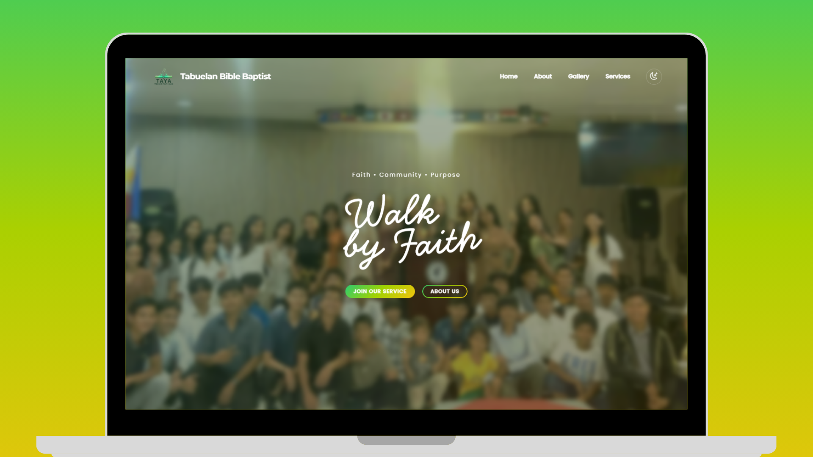
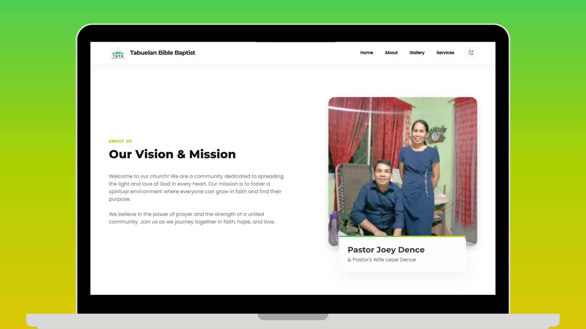
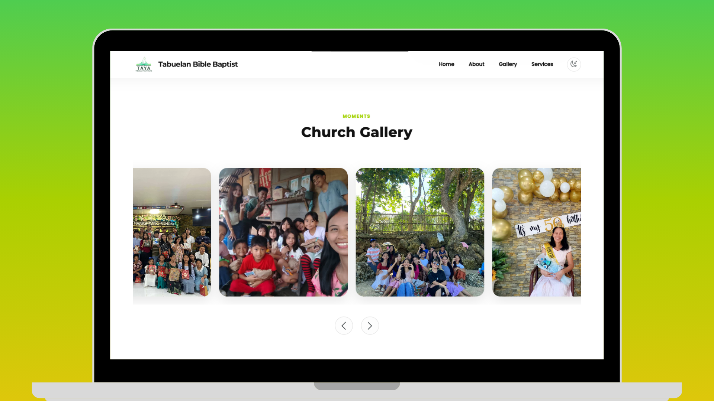

# Tabuelan Bible Baptist Church

*A dedicated platform for Tabuelan Bible Baptist Church (TAYP - Tabuelan Active Young People) to manage their events, and connect with the community.*

---

## 🌿 Screenshots

<table border="0" style="border: none; border-collapse: collapse;">
  <tr>
    <td align="center" style="border: none; padding: 8px;">
      
       
      🏠 Home Page
    </td>
    <td align="center" style="border: none; padding: 8px;">
      
       
      ✝️ Founders
    </td>
    <td align="center" style="border: none; padding: 8px;">
      
       
      🖼️ Gallery
    </td>
  </tr>
</table>

---

## 🛠️ Tech Stack

---

## ⚙️ Key Features

**📅 Event Management**
> Centralized system for tracking and announcing church events.

**🤝 Community Engagement**
> Interactive sections for youth to participate and stay connected.

**📱 Responsive Design**
> Optimized for both mobile and desktop users.

